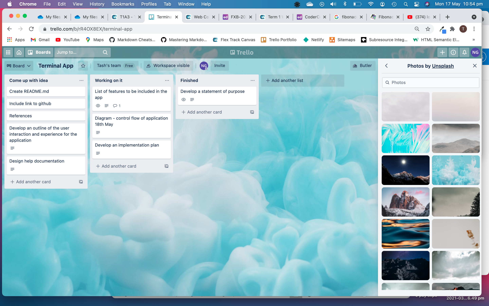
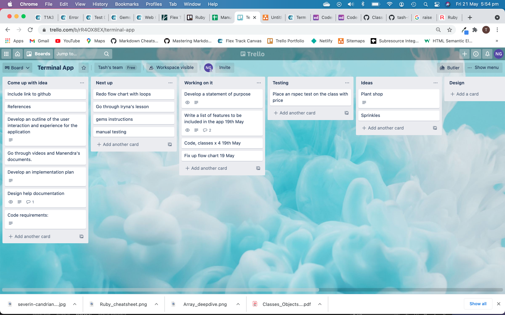
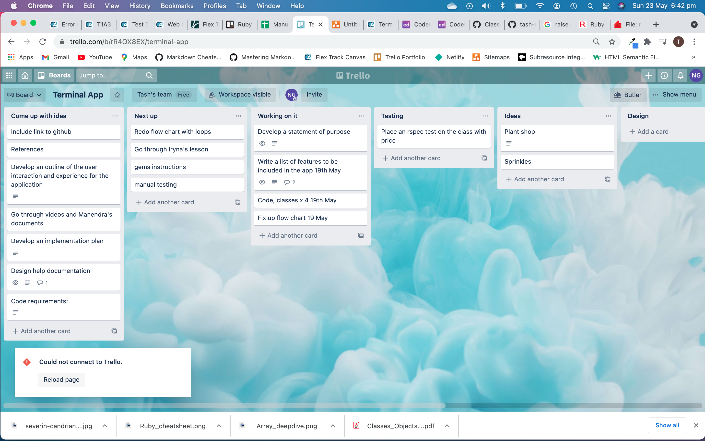
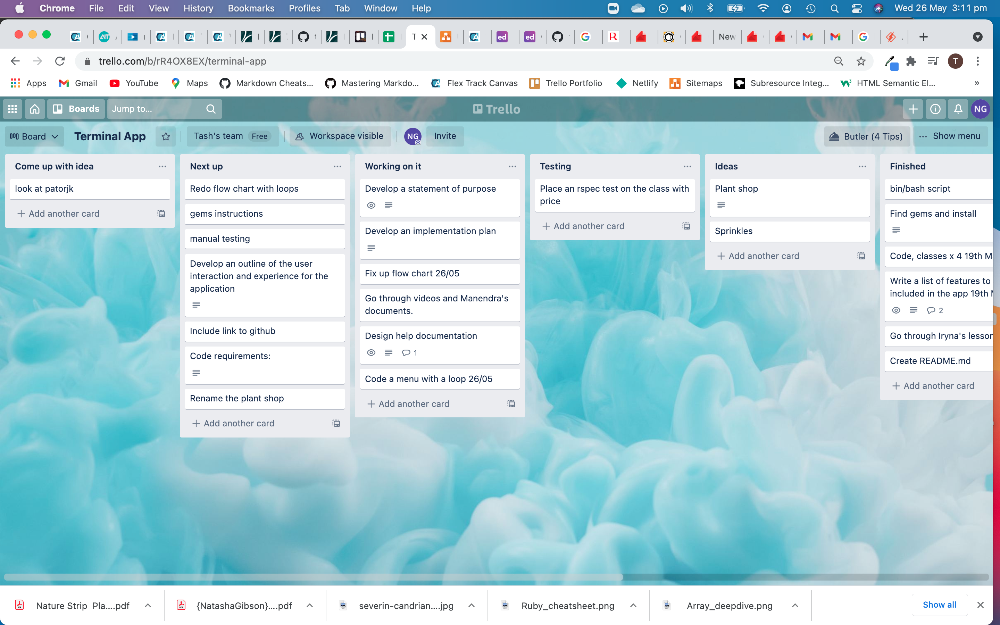
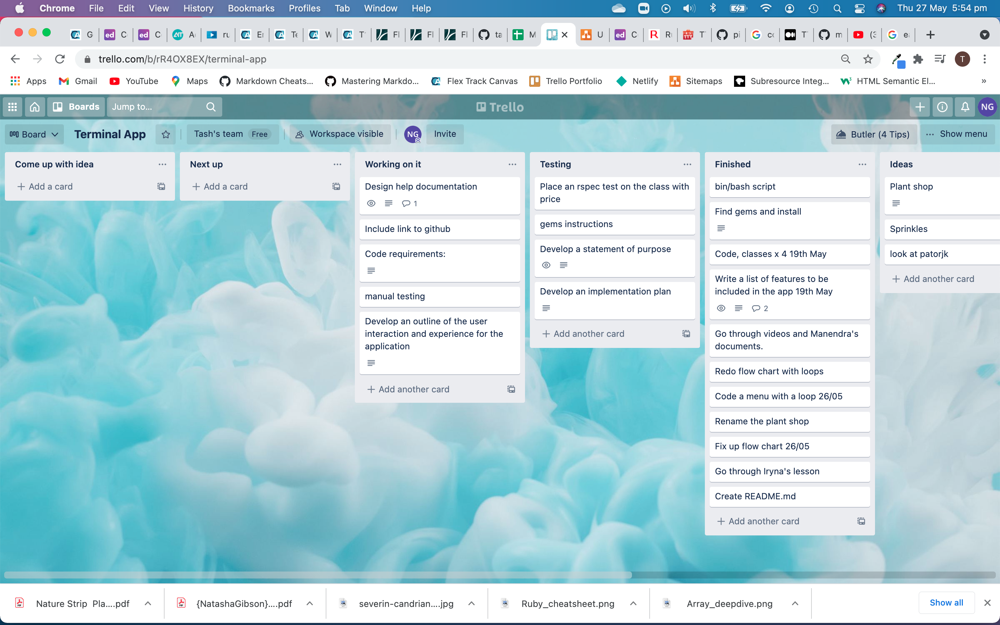
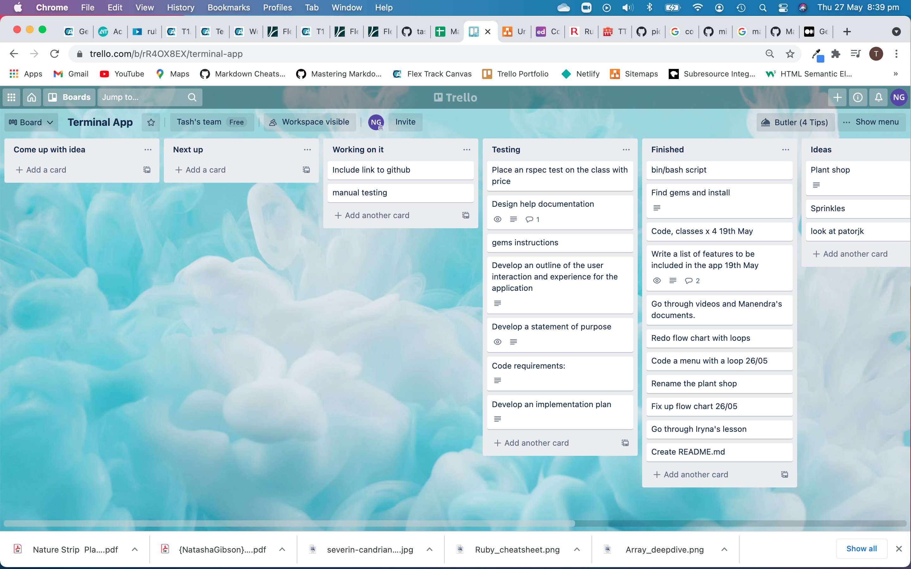
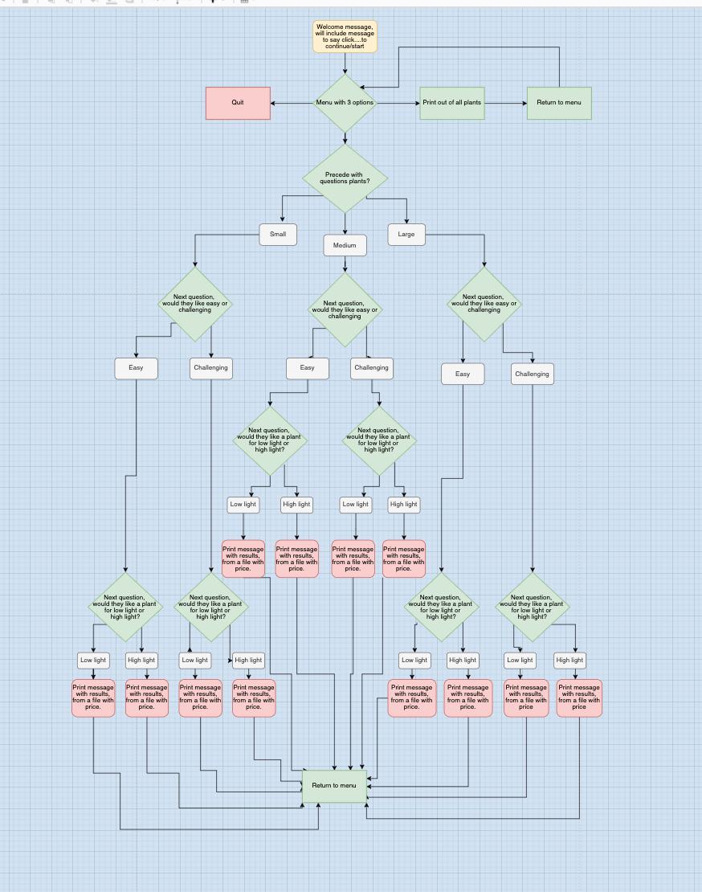
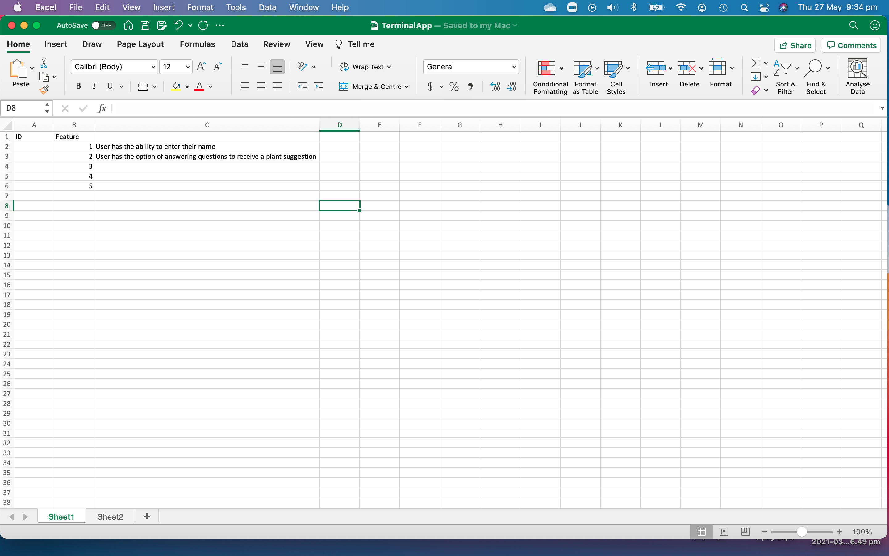
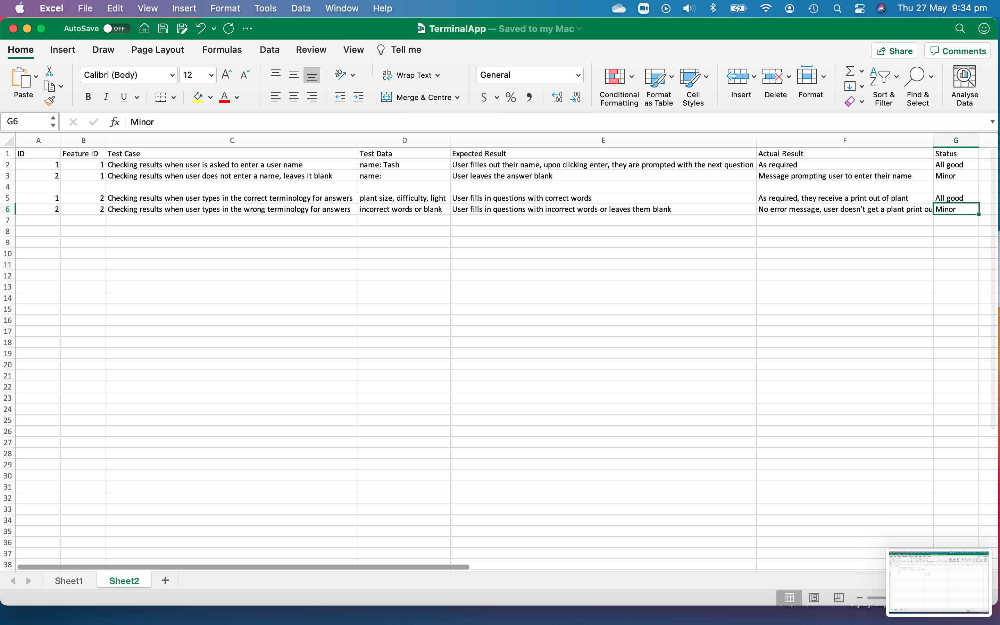

# T1A3 Terminal project

## **Link to github repo:**
[Link to github](https://github.com/tash-tag/plant_shop)
## **STATEMENT OF PURPOSE**

Plant Shop:
Describe at a high level what the site will do: 
-	This site will ask for some user input to find out what kind of plants they would like to grow eg:  size of plant, ease of care and light levels. The user will be asked some criteria about the growing conditions and how much care they want to put in. This will then generate a match, of a plant suggestion. There will also be an option to print out the entire list of plants.

## **Identify the problem it will solve and explain why you are developing it:**
- House plants are very popular, and some people struggle to keep them looking good or 
alive, this app will help them to choose a plant to suit their needs.
The app will give a guide to some plants that people can grow indoors, whether they want easy or challenging plants. It can be a daunting decision for people, this app will give people some options to make it an easier choice.

## **Identify the target audience:**
- The target audience is plant lovers who want some advice on making a good selection on indoor plants.

## **Explain how a member of the target audience will use it:**
- The user will enter some text or a number to respond to questions that will result in a plant suggestion.
## **Instructions:**
To run the program: 

- Open it from your terminal

- cd src

- ruby plant_shop.rb

- bundle install (this will install the gems that are being used in the app)

Then when prompted you can start answering the questions.

## **Help Documentation:**

- The version of Ruby that the program is using is: 2.7.3
- To run command line arguments type in: 

ruby plant_shop.rb -info or

ruby plant_shop.rb -gems

## **Explain how a member of the target audience will use it:** 

The Plant Shop app is a simple app that the user can interact with by executing responses to questions. 
The user will be prompted with questions, the user will enter some text to respond to questions or select a number in response.

When the user is asked to enter their name, if they don’t enter a name, a message will appear saying “Name must not be empty”. Then they will be prompted to enter their name.

Following is a list of the features in the app:

- menu
- How the app will suggest a plant for the user
- List of questions 
- Optional full plant list print out
- Receipt - plant suggestion with price

*Menu* - this will appear after the user has entered their name, they will be prompted to select one of the items

*How the app will suggest a plant for the user* - The app will store the users answers to the questions about the type of plant they would like, then it will sort through a list of plants in the database and select the perfect match for the user.

*List of questions* - If the user chooses to go through the questions to find a plant match they will be asked 3 questions about the type of plant they want.

*Optional full plant list print out* - In the menu there is an option to have the whole list of plants printed out with their price.

*Receipt* - A receipt will print out if the user chooses to have a plant selected for them.

## Implementation Plan

- Trello Board

Following are some trello boards that I used to keep track of my workflow throughout the project:

Flow Chart

Following is a flow chart detailing the plan of the terminal app, loops can be seen here and the various landing points that the user might find as they traverse the app:

Following are screen shots of some manual testing of the app, the first feature tested is the user name input, where the user is asked to type in their name, if they do, all is good, if they leave it blank, there is an error message asking them to enter their name. The second feature tested is when the user is asked to answer some questions about what requirements they have for their prefered plant, if they type in valid text all is good, but if they type in invalid text or leave it blank they won't receive a print out of the plant:

Thanks for reading and please go ahead and enjoy using the Plant Shop app.

